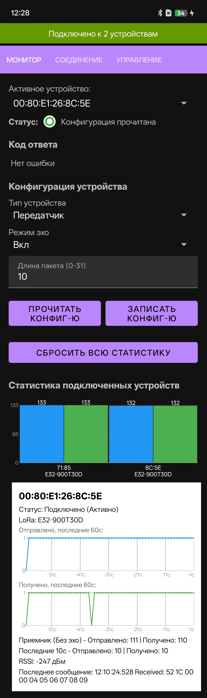
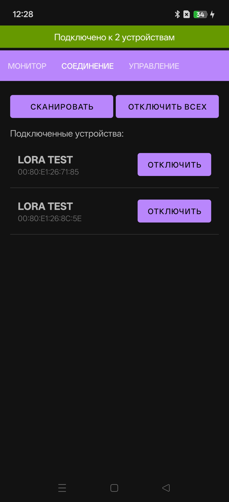
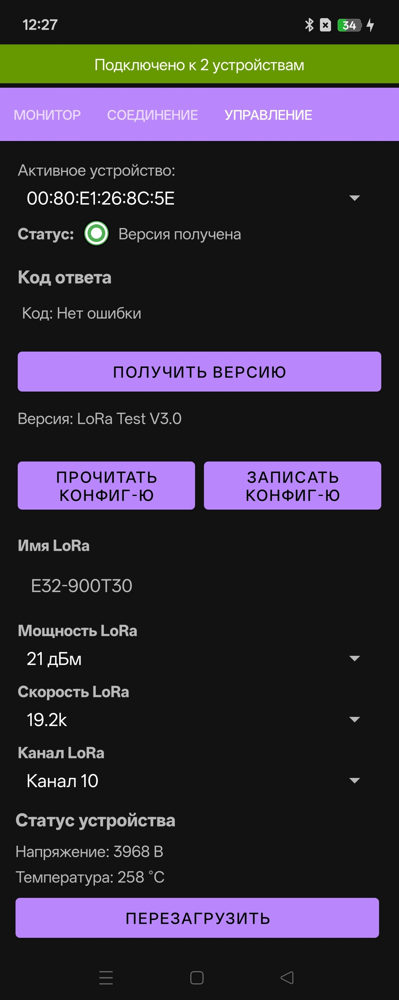

# LoRa Bench

Android-приложение для работы с беспроводными радиочастотными устройствами LoRa
через BLE (Bluetooth Low Energy). Приложение сканирует BLE-устройства, подключается к одному или нескольким из них
одновременно через GATT/UART, обменивается данными по собственному бинарному протоколу кадрирования и предоставляет
интерфейс с 3 вкладками: мониторинг данных, управление подключением, конфигурация устройства.

Строки интерфейса, сообщения логов и комментарии в коде преимущественно на русском языке.

## Скриншоты

| Мониторинг                             | Соединение                                   | Управление                                   |
|----------------------------------------|----------------------------------------------|----------------------------------------------|
|  |  |  |

## Архитектура

Код организован в три слоя в пакете `com.alextim.lora`:

- `client.ble` - транспортный слой BLE для Android (`BluetoothService`). Поддерживает подключение к 
  нескольким BLE-устройствам одновременно, каждое со своим GATT-соединением и парсером кадров.
- `service.protocol` - логика бинарного кадрирования/парсинга кадров, не зависящая от Android BLE API
  (`BleProtocolParser`, `BleMessageParser` и др.).
- `service.message` - слой типизированных команд/ответов/событий поверх протокола
- `service` - `MessageProcessingService` рассылает распарсенные сообщения через `LocalBroadcastManager`.
- `ui` - единственная activity (`MainActivity`) из трех фрагментов: `DataFragment`
  (мониторинг данных), `ConnectionFragment` (подключения), `ManagementFragment` (конфигурация устройства).
  Фрагменты общаются с сервисом через привязку `BluetoothService` и broadcast-сообщения, всегда с ключом
  `EXTRA_DEVICE_ADDRESS` для фильтрации по устройству.

